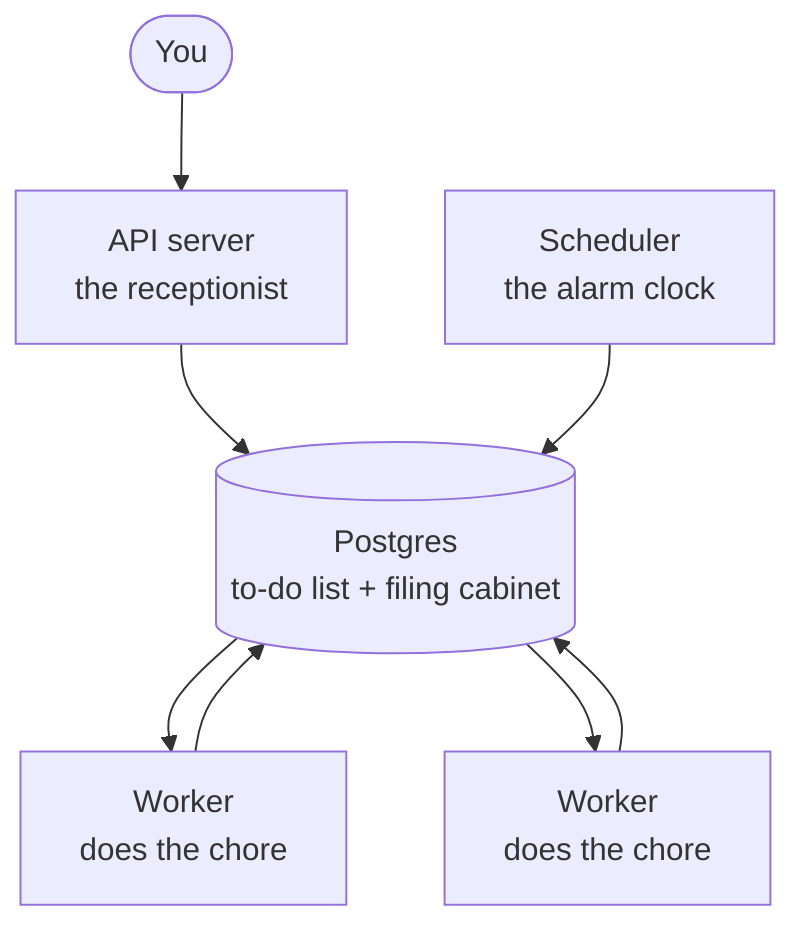

# 01: What is Conduit?

## The big idea

Conduit is a robot that does recurring chores for you. You define a chore once, and the robot runs it forever, on a schedule or when something happens.

A concrete example: every morning at 8, check the NetSuite news, summarize what changed, and send you the summary. Without Conduit, that is a thing you remember to do. With Conduit, it is a thing that happens.

The famous version of this idea is n8n. We are rebuilding its core from scratch, not to compete with it, but to learn how it works inside: servers, queues, databases, workers, retries, all of it.

## The office analogy

It helps to picture Conduit as a small office with five parts:

- **The API server is the receptionist.** It takes requests from the outside world: "run this chore now," "here is a new chore," "how did that chore go?"
- **The scheduler is the alarm clock.** It watches the calendar. When a chore's time comes, it raises its hand.
- **The workers are the staff.** They pick up chores and actually do them. When there is more work than one person can handle, you hire more staff. That is horizontal scaling, and it just means "more workers."
- **Postgres is the filing cabinet and the shared to-do list.** Everything the office knows, every chore definition and every record of what ran, lives here.
- **Redis is a second cabinet we will buy later.** Right now one cabinet is enough. Adding a second one before we feel the need would just be clutter.

## How the parts fit together

Read it like this: you talk to the receptionist. The receptionist and the alarm clock both write to the shared to-do list. Workers read the list, do the chores, and write the results back.

## What exists so far

The skeleton of the office: the receptionist's desk, one staffer, the alarm clock, the whiteboard rules, the filing cabinet blueprints, and two sample chores to test with. The staffers currently pretend to do chores. Teaching them real multi-step work is a later entry.

Next: [02: How the queue works](02-how-the-queue-works.md)
