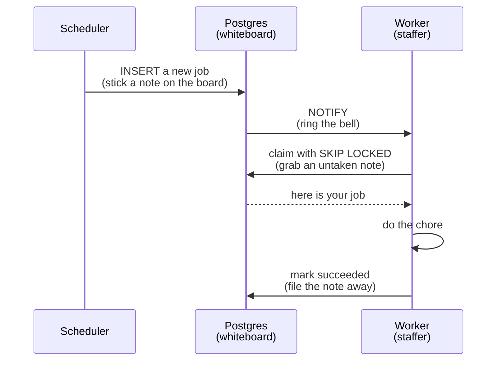

# 02: How the queue works

## The idea

The alarm clock and the receptionist both create chores. Several staffers are waiting to do them. Two questions have to be answered:

1. How does a staffer find out there is work, without checking the board every five seconds?
2. How do we guarantee two staffers never grab the same chore?

Get either one wrong and chores get done twice, or never.

## The whiteboard

All chores go on one whiteboard as sticky notes. In Postgres, that whiteboard is a table called `jobs`. Each note has a status: `queued`, `claimed`, `running`, `succeeded`, `failed`, or `dead`.

Grabbing a note works like this: a staffer says "give me one note nobody has taken," and the database hands one over while locking it in the same instant. The technical name is `SELECT ... FOR UPDATE SKIP LOCKED`. In plain words: skip the notes someone already took, lock the one you take, all in one motion so two staffers can never collide.

Our real claim (in `src/lib/queue.ts`) wraps that grab inside an `UPDATE`, so grabbing the note and stamping it `claimed` happen atomically: either both happen or neither does. There is no gap where a second staffer could slip in between.

## The bell

Staffers do not poll the board. When a new note goes up, the database rings a bell: `pg_notify`. Every staffer is listening (`LISTEN`), hears the bell, and walks over to grab a note. Fast, and no wasted checking.

One honest gap at this stage: if a bell ring is ever missed, the worker waits until the next one. There is no polling fallback yet. That is a known improvement, not an oversight we are hiding.

## The diagram



## Try it yourself

This entry's tag is `learn-02`. You will need two terminal windows.

**Do.** Start Postgres, set up the database, and put two notes on the board:

```
git checkout learn-02
docker compose -f infra/compose.yaml up -d
npm install
cp .env.example .env
npm run db:migrate
docker compose -f infra/compose.yaml exec postgres psql -U conduit -d conduit \
  -c "INSERT INTO jobs (kind, payload) VALUES ('demo', '{\"n\":1}'), ('demo', '{\"n\":2}');"
```

**See.** `INSERT 0 2`: two sticky notes on the board.

**Do.** In terminal A, grab a note and hold it. Type each line and press enter:

```
docker compose -f infra/compose.yaml exec postgres psql -U conduit -d conduit
BEGIN;
SELECT id, kind FROM jobs WHERE status = 'queued' ORDER BY run_at, id LIMIT 1 FOR UPDATE;
```

**See.** One row comes back. Terminal A is now a staffer holding that note. Do not commit; leave this terminal open.

**Do.** In terminal B, connect the same way and run:

```
BEGIN;
SELECT id, kind FROM jobs WHERE status = 'queued' ORDER BY run_at, id LIMIT 1 FOR UPDATE SKIP LOCKED;
```

**See.** It returns immediately, with the *other* row. That is `SKIP LOCKED`: it stepped over the note terminal A is holding and took the free one. No waiting, no collision. This is your prediction from entry 01, confirmed.

**Break.** In terminal B, run the same query *without* `SKIP LOCKED`:

```
SELECT id, kind FROM jobs WHERE status = 'queued' ORDER BY run_at, id LIMIT 1 FOR UPDATE;
```

**See.** Nothing. It hangs. Terminal B is a staffer standing at the board, hand outstretched, waiting for terminal A to put the note down. This is what a lock does without the skip: polite, but frozen. Press `Ctrl+C` to give up, then go to terminal A and type `COMMIT;`. Run terminal B's query once more.

**See.** This time it returns the first row immediately. The note was put back, and the waiting staffer finally got it.

**Clean up.** In both terminals type `\q` to leave psql, then:

```
docker compose -f infra/compose.yaml down
```

## What if a staffer faints?

Every grabbed note has a lease, a deadline that says "if you have not finished or checked in by this time, we assume something went wrong." A separate process, the reaper, walks the board looking for expired leases and puts those notes back up for someone else. That is crash recovery, and it is why no chore silently vanishes. The lease column (`lease_expires_at`) is already in the table; the reaper arrives in a later entry.

## What we actually did

This decision is recorded formally as ADR-001, and the mechanism lives in `src/lib/queue.ts` (`enqueueJob`, `claimJob`, `listenForJobs`) with the table defined in `db/migrations/001_init.sql`. Browse it all at the [`learn-02`](https://github.com/VaidikV/conduit/tree/learn-02) tag.

The honest reasoning: Redis is the industry default here and it is faster. But it is memory-first, so surviving crashes needs extra machinery, and it would be a second database to operate from day one. Postgres gives the cleanest correctness story: grabbing a note and stamping it happen inside one transaction, so nothing falls through the cracks. We add Redis the day we can point at something specific that hurts without it.

## Check your understanding

1. Why is the claim an `UPDATE` containing a subselect, instead of a `SELECT` followed by a separate `UPDATE`? (Hint: what could happen *between* the two steps?)
2. What does the lease protect against that `SKIP LOCKED` does not?
3. The scheduler has a comment admitting that two schedulers could double-enqueue the same workflow. How would you fix it using the pattern from this entry?
4. Ask your AI assistant to explain what `FOR UPDATE SKIP LOCKED` does, then find one thing it got wrong or left out compared to what you just observed.

Previous: [01: What is Conduit?](01-what-is-conduit.md)
