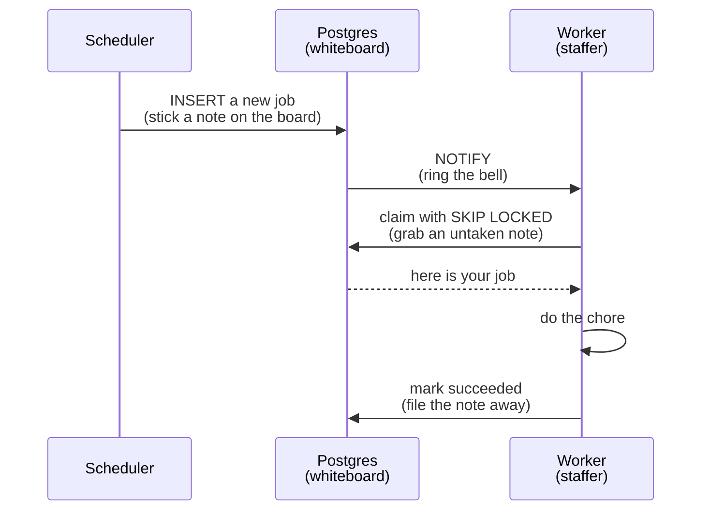

# 02: How the queue works

## The problem

The alarm clock and the receptionist both create chores. Several staffers are waiting to do them. Two questions have to be answered:

1. How does a staffer find out there is work, without checking the board every five seconds?
2. How do we guarantee two staffers never grab the same chore?

Get either one wrong and chores get done twice, or never.

## The whiteboard

All chores go on one whiteboard as sticky notes. In Postgres, that whiteboard is a table called `jobs`. Each note has a status: `queued`, `claimed`, `running`, `succeeded`, `failed`, or `dead`.

Grabbing a note works like this: a staffer says "give me one note nobody has taken," and the database hands one over while locking it in the same instant. The technical name is `SELECT ... FOR UPDATE SKIP LOCKED`. In plain words: skip the notes someone already took, lock the one you take, all in one motion so two staffers can never collide.

## The bell

Staffers do not poll the board. When a new note goes up, the database rings a bell: `pg_notify`. Every staffer is listening (`LISTEN`), hears the bell, and walks over to grab a note. Fast, and no wasted checking.

## The full flow

## What if a staffer faints?

Every grabbed note has a lease, a deadline that says "if you have not finished or checked in by this time, we assume something went wrong." A separate process, the reaper, walks the board looking for expired leases and puts those notes back up for someone else. That is crash recovery, and it is why no chore silently vanishes. The lease column (`lease_expires_at`) is already in the table; the reaper arrives in phase 2.

## Why Postgres and not Redis?

Redis is the industry default for this job, and it is faster. But it is memory-first, so surviving crashes needs extra machinery, and it would be a second database to operate from day one. Postgres gives us the cleanest correctness story: grabbing a note and updating its status happen inside one transaction, so nothing can fall through the cracks.

The honest plan: start with one database done well. Add Redis later, the day we can point at something specific that hurts without it. That migration will be its own entry.

This decision is also recorded formally in [ADR-001](../architecture.md).
