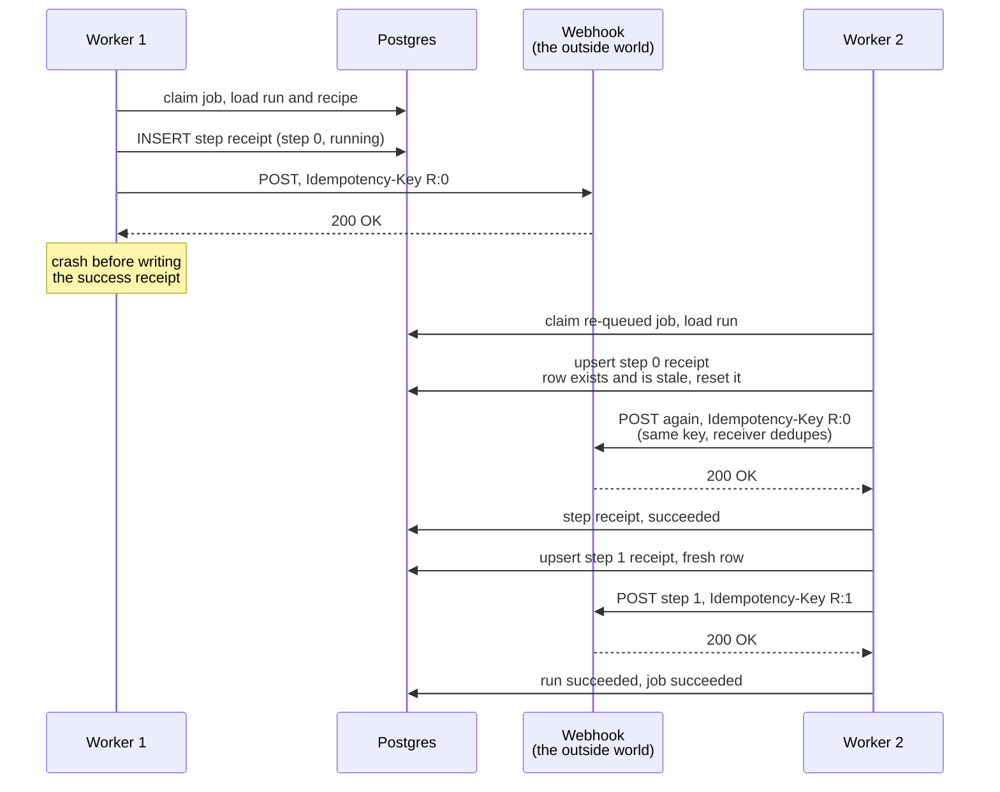

# 04: How a run survives a crash

## The idea

Entry 03 ended with an honest gap: if a worker dies mid-run, the run just dies with it. Phase 2 is about closing that gap, and the first decision is the one everything else builds on: **what does Conduit promise when a worker crashes halfway through a run?**

Picture it concretely. A run has two steps. The worker fires step 0's POST, the webhook answers 200, and then the worker's process is killed before it writes the success receipt. A replacement worker picks up the unfinished run. What should happen?

Three candidate promises:

- **At-most-once:** never retry. No duplicates, but the run's work can silently vanish. A crashed run means a webhook that never got called and nobody noticing.
- **At-least-once:** retry the unfinished work. Nothing is ever lost, but a step might execute twice. That POST might fire twice.
- **Exactly-once:** every step executes precisely one time. Sounds ideal, and is impossible here. The POST happens on someone else's server, outside our database. No transaction we run can reach out and undo a request that already landed. This is not a limitation of our code; it is the shape of the network.

We chose **at-least-once execution with at-most-once effects per step**. In plain words: a crashed run always resumes and finishes, and a step that already completed never re-fires. The receipt ledger from entry 03 is what makes this possible, and it is the one place our design differs from n8n's.

How n8n actually handles this, for comparison: when a worker crashes, n8n restarts the execution **from the beginning**. It does not checkpoint mid-workflow state, and retrying a failed execution creates a brand-new execution that also starts at step one. The official guidance is "make your nodes idempotent," which pushes the duplicate problem onto the workflow author. Its per-node retry is a fixed wait (capped at 5 tries, 5 seconds between tries) that retries *every* error, including ones that will never succeed on retry, like a malformed request.

We can do better with one mechanism we already built: the step receipts. When the replacement worker resumes a run, it reads the ledger first. Step 0's receipt says `succeeded`, so the worker skips it and continues from step 1. The common crash case becomes duplicate-free with zero effort from the workflow author. n8n never built recovery on top of its progress data; we did.

One dangerous window remains: the POST fired and the 200 came back, but the worker died *before* writing the success receipt. The ledger says step 0 is still `running`, so the resume re-fires it. For that window we attach a deterministic idempotency key to every outgoing request:

```
Idempotency-Key: <run_id>:<step_index>
```

Same run, same step, same key, on every attempt. A receiver that honors the key (Stripe does, many webhooks do) sees the second POST, recognizes the key, and dedupes instead of applying the request twice. If the author sets their own `Idempotency-Key` header, theirs wins. If the receiver ignores the key entirely, the duplicate can still happen, and that residual risk is documented, not hidden. Honesty about the last 1% is part of the promise.

The mechanism that makes the ledger safe to resume from is one row per (run, step), enforced by a real database constraint. The executor claims each step's row with a single upsert: insert it fresh, or reset a stale one left behind by a crashed worker. If the row is already `succeeded` for the same step id, the upsert matches nothing and the step is skipped. A stale `running` or `failed` row gets reset and re-executed, with the `attempt` counter going up so the audit trail shows it happened. And if the step *id* at that position changed (someone edited the recipe mid-run), the old receipt is for a different step, so it re-runs rather than being trusted.

What this entry does **not** do, deliberately: nothing yet *triggers* a resume automatically. No code re-queues a crashed run's job (that is the reaper, coming next), there is no retry policy or backoff yet, and there are no worker heartbeats. This entry builds the mechanism that makes resume safe. The policy that decides *when* to resume gets its own design decision.

## The diagram



The two lines to stare at: the upsert that turns "claim a step" and "resume a step" into the same operation, and the repeated `Idempotency-Key R:0`. The key is the only thing that crosses the boundary into the outside world, so it is the only thing that can protect the one window the ledger cannot see.

## Try it yourself

This entry's tag is `learn-04`. You need the local stack running.

**Do.** Check out the tag, start Postgres, migrate, and start the counting receiver from the entry (any tiny HTTP server that logs headers works; the point is watching the `idempotency-key` header):

```
git checkout learn-04
docker compose -f infra/compose.yaml up -d
npm install
cp .env.example .env
npm run db:migrate
```

**Do.** Create a two-step workflow pointing both steps at your receiver, run it, and inspect the request headers.

**See.** Both requests carry `idempotency-key`: `<runId>:0` and `<runId>:1`. Same run, deterministic keys. Now query the step receipts.

**See.** Two rows, one per step, each with `attempt: 1`.

**Break.** Simulate the crash window by hand: pick the run id, set step 0's receipt back to `status = 'running'` in the database, reset the run to `running`, and execute the run again (via the worker, or by calling the executor the way a resumed job would).

**See.** Step 0 re-fires exactly once, with the *identical* idempotency key as the first attempt. Step 1 is untouched. The receipt row for step 0 now reads `attempt: 2`. One row per step, before and after. That is the whole mechanism, observable in three queries.

**Break.** Now set step 0's receipt to `succeeded` but change the step's `id` in the workflow definition, and resume again.

**See.** The step re-fires. The old receipt belonged to a different step, so the executor refuses to trust it. This is the definition-changed-mid-run case, and the safe default is to redo the work, not skip it.

**Decide and defend.** Before reading the code: the executor skips a step only when the receipt is `succeeded` *and* the step id matches the recipe. Why both conditions? Construct the failure each missing condition would allow. (Then check the upsert in `src/lib/executor.ts`.)

**Clean up.** `docker compose -f infra/compose.yaml down`.

## What we actually did

- `db/migrations/003_step_identity.sql`: a `UNIQUE (run_id, step_index)` constraint on `step_executions`, so exactly one row owns the truth about step N of run R. Without it, a resumed run could stack a second row for the same step and the "already done" check would be ambiguous.
- `src/lib/executor.ts`: `executeRun` now claims each step with `INSERT ... ON CONFLICT DO UPDATE`. Succeeded steps (same step id) are skipped, stale `running`/`failed` rows are reset with `attempt + 1`, and a second call for a finished run is still a no-op. Every `http_request` now sends `Idempotency-Key: <run_id>:<step_index>` unless the author set their own.
- Verified against real Postgres 16 with 27 checks: normal runs fire each step once with deterministic keys, a resume after a step failure skips the completed step without re-firing it, the crash window re-fires with the identical key across attempts, an author-supplied key is respected, a mid-run definition change invalidates the old receipt, and finished runs are never executed twice. Browse it at the [`learn-04`](https://github.com/VaidikV/conduit/tree/learn-04) tag.

Deliberately not built yet: the reaper that re-queues crashed jobs, the retry policy with backoff, and worker heartbeats. The executor is now safe to call again; the next entries decide when to call it.

## Check your understanding

1. Why is the idempotency key `<run_id>:<step_index>` instead of a fresh random UUID on every attempt? What breaks with the random version?
2. Exactly-once is impossible here because the POST lives outside our database. Suppose the webhook were *another table in the same Postgres*. Would exactly-once become possible? Why?
3. n8n restarts crashed executions from the beginning and tells authors to make nodes idempotent. We resume from the ledger instead. Name one workload where n8n's approach is actually *simpler* for the author, and one where ours is safer.
4. The upsert resets a `failed` step's row and re-runs it on resume. But right now nothing automatically resumes a failed run. What would go wrong if the *worker itself* re-queued the job immediately on every failure, with no backoff and no attempt limit?

Previous: [03: How a chore actually runs](03-how-a-chore-actually-runs.md)
