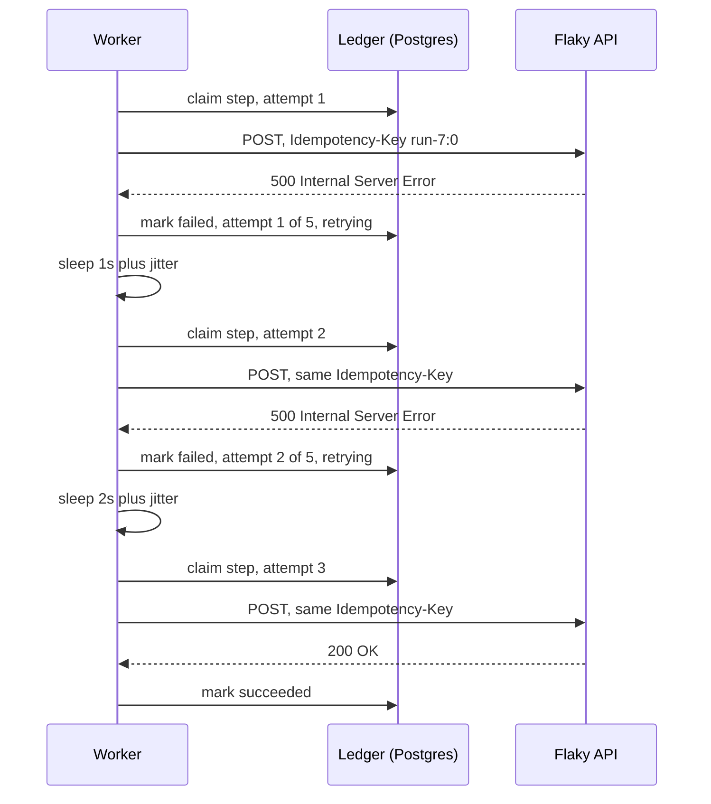

# 05. How a step learns to knock politely

*Retry policy and exponential backoff. Entry tag: `learn-05`.*

## The idea

A step fails. Now what? The answer depends on *why* it failed, and getting this right is the difference between a system that heals itself and one that either gives up too easily or hammers a dying server.

Think of it as calling a friend. If their phone is off, calling back later is sensible. That is a `500`, a timeout, a dropped connection: the server is having a bad moment. But if you dialed a wrong number and a stranger answers, calling again changes nothing. You have to fix the number first. That is a `400` (your request was malformed) or a `401` (bad credentials): retrying the identical request will fail identically. And a `429` is your friend saying "stop calling me so much": definitely try again, but wait longer than usual.

So Conduit's policy has two halves. First, *which* failures are worth retrying: network errors, timeouts, and HTTP 408, 429, 500, 502, 503, 504. Everything else fails the step immediately. Second, *how long to wait* between tries.

For the wait, picture waiting on someone in the shower. Knocking every ten seconds does not make them faster, it is just annoying. You knock, wait a bit, knock, wait longer. The waits double each time: 1 second, 2, 4, 8, capped at 30. When a server is struggling, the kindest thing is to get out of its way fast, and doubling gets you out of the way fast. This is exponential backoff.

One wrinkle: if a hundred callers all wait exactly two seconds and knock again at the same instant, they slam the server together. That is called a thundering herd. So each wait gets a sprinkle of randomness, up to one extra second, to spread everyone out. That sprinkle is jitter.

And there is a budget. At some point you stop knocking and leave a note on the door. Conduit tries each step up to 5 times by default, and the workflow author can set any budget from 1 (no retries) to 10 per step. A step that burns its budget fails the run, same as before.

Two details make this trustworthy rather than just hopeful. First, every retry of a step sends the *identical* idempotency key (`<run_id>:<step_index>`), so if attempt 1 actually reached the server but its response was lost, attempt 2 cannot double-apply on a cooperating receiver. Second, the attempt counter lives in the ledger row, not in the worker's memory. If the worker crashes during a backoff sleep, the resumed worker reads the row, sees attempt 3 of 5 already recorded, and continues with the same remaining budget instead of starting the count over.

## The diagram



The shape to notice: the worker talks to the ledger before and after every attempt, the key never changes across retries, and the sleeps grow. If the worker died during any sleep, the next worker would pick up the same row and the same count.

## Try it yourself

This entry's tag is `learn-05`. You need the local stack running.

**Do.** Check out the tag, start Postgres, migrate:

```
git checkout learn-05
docker compose -f infra/compose.yaml up -d
npm install
cp .env.example .env
npm run db:migrate
npm run dev:api
```

**Do.** In another terminal, start the worker, then create a workflow whose step points at a port where nothing listens (`localhost:9` refuses connections, which is retryable), and run it:

```
npm run dev:worker
curl -s -X POST localhost:3000/workflows \
  -H 'content-type: application/json' \
  -d '{"name":"retry-demo","definition":{"version":1,"trigger":{"type":"manual"},"steps":[{"id":"ping","type":"http_request","config":{"method":"POST","url":"http://localhost:9/dead"}}]}}'
curl -s -X POST localhost:3000/workflows/<id>/run -H 'content-type: application/json' -d '{}'
```

**See.** Poll the run while it works:

```
curl -s localhost:3000/runs/<runId>
```

Watch the step receipt: `attempt` climbs 1, 2, 3, 4, 5, and the `error` field reads `(attempt 2/5, retrying)` between tries. Time it: the run takes about 15 seconds to fail, and you can feel the 1s, 2s, 4s, 8s waits if you poll once a second. Then the run goes `failed`. Five attempts, one ledger row, no human involved.

**Break.** Now point the step at the API's own nonexistent route, `http://localhost:3000/nope`, which returns 404, and run it.

**See.** The run fails in under a second and the receipt reads `attempt: 1`. A 404 is a wrong number: the request will never succeed, so Conduit does not waste four retries proving it. Contrast this with the `localhost:9` run above. Same failure shape (a dead step), opposite treatment, and the status code is what decides.

**Break.** Try to be generous: set `"retry": {"maxAttempts": 99}` on the step and create the workflow.

**See.** The API answers `400`. Budgets above 10 are rejected at definition time, because at the 10-attempt ceiling a step can already hold a worker for over two minutes of backoff. The author gets a say, not a blank check.

**Decide and defend.** Before reading the code: the retry loop reads the attempt number back from the ledger row on every iteration instead of keeping a local counter. What breaks if it used a local counter instead? (Hint: the worker can die *during* a backoff sleep.) Then check the claim query in `src/lib/executor.ts`.

**Clean up.** `docker compose -f infra/compose.yaml down`.

## What we actually did

- `src/lib/retry.ts` (new): the whole policy in one small module. `StepHttpError` carries the HTTP status (or no status for network failures and timeouts), `isRetryable` encodes the retryable set, `backoffDelayMs` is the 1s-doubling-capped-at-30s-plus-jitter formula, `parseRetryAfter` handles both `Retry-After` forms, and `retryDelayMs` takes the longer of backoff and a capped `Retry-After` on 429s.
- `src/lib/executor.ts`: `runStep` now runs inside a retry loop. Each iteration re-claims the ledger row with the existing upsert (so resume-after-crash keeps working), reads the attempt number from the row, and on failure either sleeps with backoff and retries or marks the step and run failed. `validateDefinition` rejects `retry.maxAttempts` outside 1-10. `runHttpRequest` throws `StepHttpError` so the policy can see the status.
- `docs/architecture.md`: ADR-003 records the decision, the options, and the trade-off of sleeping in the worker.
- Verified against real Postgres 16 with 57 checks: the full `isRetryable` matrix, both `Retry-After` forms, backoff bounds and cap, validation rejections, a flaky endpoint recovering on attempt 3 with one ledger row and an identical idempotency key across retries, a 400 failing fast with one attempt, a 500 exhausting all 5 attempts over the expected ~15s of growing waits, `Retry-After: 3` honored over the shorter backoff, timeouts retried, a custom 2-attempt budget with an author-supplied key preserved, and a simulated crash-during-backoff resuming with exactly the remaining budget. Browse it at the [`learn-05`](https://github.com/VaidikV/conduit/tree/learn-05) tag.

Deliberately not built yet: what happens *after* the budget is exhausted (dead-lettering, alerting), worker lease heartbeats, and the reaper that re-queues crashed jobs. The executor now retries on its own; the next entries decide who notices when retries run out.

## Check your understanding

1. A step gets `403 Forbidden`. Retried or not? What about `503 Service Unavailable`? Say why in one sentence each.
2. Why do the waits double instead of staying at a fixed 1 second? Who benefits from the growth?
3. Two runs of the same workflow hit the same flaky API at the same moment and both start retrying. What keeps their retries from landing in lockstep?
4. A `429` arrives with `Retry-After: 600`. How long does Conduit actually wait before the next attempt, and why not the full 600 seconds?
5. The workflow author sets `maxAttempts: 1`. What does that mean, and when would you want it?
6. **Supervise the machine.** Ask an AI to explain why the idempotency key must stay identical across retries but *may* differ between two steps of the same run. Then find the flaw in its answer, if any. (Ours: retries repeat the same logical request, so they share a key; different steps are different requests, so each gets its own.)
