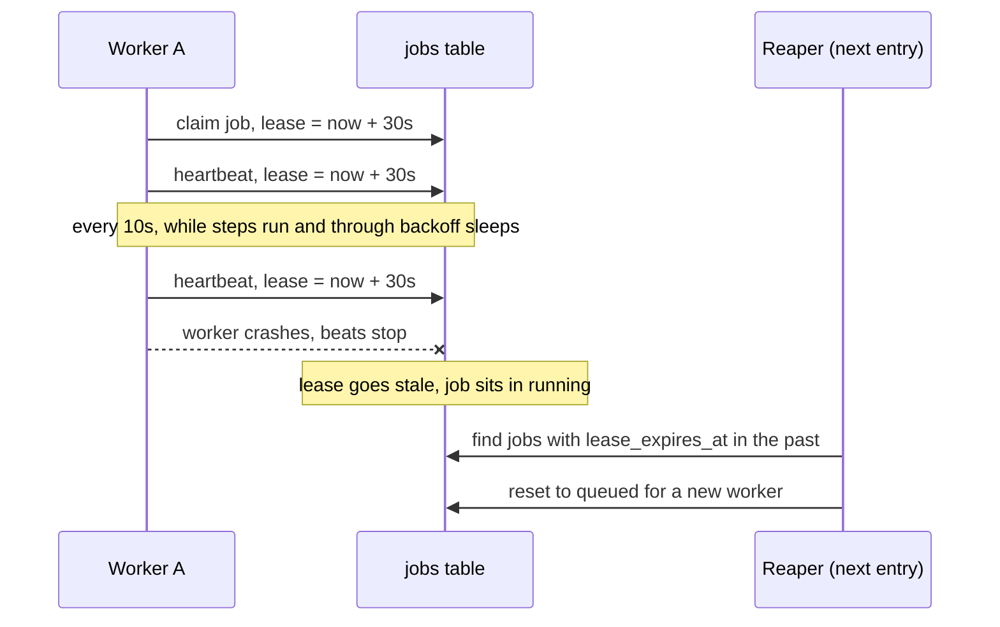

# 06. How the worker proves it is still alive

*Lease heartbeats. Entry tag: `learn-06`.*

## The idea

When a worker claims a job, the job row gets a lease: `lease_expires_at`, set to 30 seconds out. Until this entry, nothing ever renewed it. If the worker died mid-run, the job sat in `running` with a dead lease forever, and no one came looking. The resume machinery from entry 04 only helps if something actually re-runs the job. Nothing did.

The fix is the driver's radio check-in. While a worker owns a job, it re-stamps the lease every 10 seconds: "still alive, still working on this one." That re-stamp is the heartbeat. Thirty seconds of radio silence means the driver is presumed dead, and the job becomes eligible for someone else to pick up (that pickup is the reaper, the next entry; this entry builds the heartbeat half).

The numbers are a pair and the ratio is the point. Beat every 10, dead after 30. If one beat gets lost to a slow database or a garbage-collection pause, the next one still lands with room to spare. Two missed beats in a row still do not kill the lease. The 1:3 ratio is the standard shape: frequent enough to notice death quickly, forgiving enough that a merely slow worker is not mistaken for a dead one.

Three details keep this honest.

First, the heartbeat runs on a timer that is independent of the work. Entry 05 put the worker to sleep for up to 8 seconds between retries. If heartbeats only fired between steps, those sleeps would look like radio silence and a merely patient worker would look dead. The timer keeps beating through backoff sleeps.

Second, every lease write checks ownership. The renew query says: update the lease only if this job is still claimed by *me*. If the reaper gave the job to someone else while I was partitioned away, my beat matches zero rows. I stop beating. A zombie worker cannot resurrect a lease it no longer owns.

Third, finishing is ownership-checked too. Picture the interleaving: I am partitioned, the reaper reassigns my job to worker B, then my partition heals and my execution finishes. An unconditional "mark succeeded" from me would stamp *B's* job as done and clear *B's* lease. So `finishJob` also requires `claimed_by = me`, and when it matches zero rows the worker logs that its result was discarded. The surviving execution is the one that counts, and entries 04 and 05 are why that is safe: the new worker resumes from the step ledger, skips completed steps, and retries share idempotency keys. The phase-2 order was deliberate. Heartbeats plus a reaper can cause two workers to run one job, and at-least-once with idempotent steps is the net that catches it.

## The diagram



The bottom half is the cliffhanger: as of this entry, the reaper does not exist yet, so a stale lease just sits there. That silence is exactly what the next entry builds.

## Try it yourself

This entry's tag is `learn-06`. You need the local stack running.

**Do.** Check out the tag, start Postgres, migrate, and open two terminals:

```
git checkout learn-06
docker compose -f infra/compose.yaml up -d
npm install
cp .env.example .env
npm run db:migrate
```

**Do.** Start the worker in one terminal and the API in the other. Create a workflow whose step points at `http://localhost:9/dead` (connection refused, retryable, about 15 seconds of backoff), and run it. While it runs, watch the lease from a third terminal:

```
npm run dev:worker
curl -s -X POST localhost:3000/workflows \
  -H 'content-type: application/json' \
  -d '{"name":"hb-demo","definition":{"version":1,"trigger":{"type":"manual"},"steps":[{"id":"ping","type":"http_request","config":{"method":"POST","url":"http://localhost:9/dead"}}]}}'
curl -s -X POST localhost:3000/workflows/<id>/run -H 'content-type: application/json' -d '{}'
```

**See.** Find the job id (`SELECT id FROM jobs ORDER BY created_at DESC LIMIT 1;`) and poll its lease:

```
SELECT status, claimed_by, lease_expires_at, now() FROM jobs WHERE id = '<jobId>';
```

Run that query every few seconds. The lease jumps forward by 30 seconds roughly every 10 seconds, *including while the worker is sleeping between retries*. The radio never goes quiet just because the driver is waiting.

**Break.** While the run is still going, kill the worker hard: `kill -9 <worker pid>` (find it with `ps aux | grep dev:worker`). Then keep polling the lease.

**See.** The beats stop. After at most 30 seconds the lease is in the past, and... nothing happens. The job sits in `running` with a stale lease, forever. That nothing is the honest boundary of this entry: the heartbeat proves death is *detectable*; the reaper that *acts* on it is decision 4. Restart the worker and note that it does not pick the job up either. The next entry fixes both.

**Decide and defend.** Before reading the code: `renewLease`, `markRunning`, and `finishJob` all require `claimed_by = this worker` before writing. For each one, construct the exact interleaving where the unconditional version corrupts something. (Then check `src/lib/queue.ts`.)

**Clean up.** `docker compose -f infra/compose.yaml down`.

## What we actually did

- `src/lib/queue.ts`: `LEASE_TTL_SECONDS = 30` and `HEARTBEAT_INTERVAL_MS = 10_000` with the 1:3 rationale in a comment. `claimJob` sets the lease with `make_interval` from the constant instead of a hardcoded literal. New `renewLease(jobId, workerId)` returning whether we still own the job. `markRunning` and `finishJob` now take the worker id and are conditional on ownership, returning whether the write happened. A zombie's writes match zero rows and change nothing.
- `src/worker/index.ts`: after claiming, the worker starts a heartbeat timer that calls `renewLease` every 10 seconds. A beat that finds the lease lost stops the timer and logs; a beat that throws (transient DB blip) logs and keeps going, because a failed radio call must not abort the work. The timer is cleared when the job finishes, and `finishJob`'s return value is checked so a discarded zombie result is logged, not silent.
- `docs/architecture.md`: ADR-004 records the decision and the trade-offs.
- Verified against real Postgres 16 with 23 checks: lease set at claim, renewal extends it, zombie renew/mark/finish all no-op without touching the row, the lease never goes stale during 3 seconds of heartbeated work and does go stale after beats stop, heartbeats keep firing through real retry-backoff sleeps with the lease staying fresh, and the real worker still completes a run end to end with the lease cleared on finish. Browse it at the [`learn-06`](https://github.com/VaidikV/conduit/tree/learn-06) tag.

Deliberately not built yet: the reaper that finds stale leases and re-queues the jobs, and dead-lettering for jobs that exhaust their attempts. The heartbeat makes death detectable; the next entry acts on it.

## Check your understanding

1. A heartbeat query hangs for 25 seconds and then succeeds. Was the lease ever stale? What does the 1:3 ratio protect against, and what does it *not* protect against?
2. Worker A is partitioned: it cannot reach the database but keeps executing. The reaper gives its job to worker B, and both run the step that POSTs a payment. Why is the customer not charged twice? Name the two earlier decisions doing the work.
3. Why must the heartbeat live on a timer instead of firing between steps? What entry-05 behavior forces this?
4. Walk the interleaving where an unconditional `finishJob` corrupts a job: who writes what, in which order, and what does the jobs row say at the end?
5. **Supervise the machine.** Ask an AI what happens today when a worker is `kill -9`'d mid-run, then find what its answer gets wrong or leaves out. (Ours: the lease goes stale and absolutely nothing reaps it yet. If the answer claims the job is retried, that is the missing reaper.)
