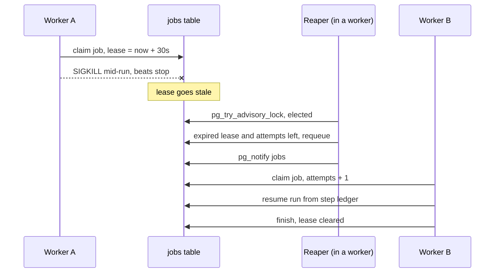

# 07. How crashed jobs get rescued

*The expired-job reaper and automatic crash recovery. Entry tag: `learn-07`.*

## The idea

Entry 06 made death detectable: a crashed worker's lease goes stale. But detection without action is just observability. This entry closes the loop. The reaper is a background sweep that finds jobs with expired leases and does something about them, which means crashed runs now recover with no human involved.

The dispatcher analogy, finished. Every 30 seconds the dispatcher scans the board for packages whose driver has been radio-silent past the 30-second lease. For each one, two fates. The unlucky package, a driver who genuinely died, goes back on the loading dock as `queued`, the old driver's name wiped, and the bell rung (`pg_notify`) so idle workers wake up. The cursed package, one that has already burned through all its deliveries, is retired to `dead`.

That second fate is the poison-package problem from the last lesson. The jobs table counts *deliveries*: every claim bumps `attempts`, and `max_attempts` (default 3) caps them. A job whose worker keeps crashing gets reaped and retried until `attempts` hits the cap, then it goes `dead` instead of looping forever. When a dead job belonged to a workflow run, the run is marked `failed`, because that run will never execute again. (What `dead` means beyond that, alerting, inspection, replay, is the next decision: dead-letter behavior.)

Two budgets are now in play, at two timescales, and keeping them straight matters. Step retries (entry 05) spend seconds apart against transient API failures: the *work* is flaky. Job attempts spend about a minute apart against dead workers: the *driver* is flaky. A 500 from a sick API spends the first; a `kill -9` on the worker spends the second. A poison job, a workflow that fails deterministically, spends both until each budget says stop.

Two mechanics keep the reaper safe. First, only one reaper sweeps at a time. Every worker attempts the sweep every 30 seconds, but a Postgres advisory lock elects exactly one; the rest no-op. If the elected worker dies mid-sweep, the lock dies with its database connection and another worker takes over on the next sweep. No extra process to deploy, no duplicate reaping, automatic failover. Second, reaping is idempotent and ownership-checked all the way down: the sweep only touches `claimed`/`running` jobs with expired leases, the reset values are absolute rather than relative, and the worker's heartbeat and finish paths (entry 06) already refuse to touch a job they no longer own. Even two reapers racing would converge on the same outcome.

## The diagram



The shape to notice: the crashed worker never comes back into the picture. Everything after the SIGKILL is the system healing itself: detect, requeue, notify, reclaim, resume.

## Try it yourself

This entry's tag is `learn-07`. You need the local stack running.

**Do.** Check out the tag, start Postgres, migrate, and start the API plus *two* workers (two terminals):

```
git checkout learn-07
docker compose -f infra/compose.yaml up -d
npm install
cp .env.example .env
npm run db:migrate
npm run dev:api
```

**Do.** In the worker terminals, `npm run dev:worker` in each. Create a workflow whose step points at `http://localhost:9/dead` (connection refused, retryable, so the run takes about 15 seconds of backoff) and run it. About 5 seconds in, `kill -9` the worker that claimed it (its log line says `claimed job <id>`).

**See.** Within about 30 seconds, the *surviving* worker logs `reaper: requeued 1, dead 0`, claims the job, and the run completes. Query the step receipt: one row, `attempt` 2, the resume picked up where the dead worker left off. Nobody paged you. That is automatic crash recovery.

**Break.** Make a poison job. Create the workflow, run it, and before the worker finishes, set the job's attempts to its max in the database:

```
UPDATE jobs SET attempts = max_attempts WHERE id = '<jobId>';
```

Then `kill -9` the worker mid-run and expire the lease by hand (`UPDATE jobs SET lease_expires_at = now() - interval '1 second' WHERE id = '<jobId>';`).

**See.** The next sweep logs `reaper: requeued 0, dead 1`. The job goes `dead`, the run goes `failed`, and no worker ever touches it again. Without the attempts check, this job would have been reaped and retried forever.

**Decide and defend.** Before reading the code: the reaper's requeue query requires `attempts < max_attempts`, and a separate query sends the rest to `dead`. Why not simply reset every expired lease to `queued` and let the next claim sort it out? Construct the job that never stops without the check. (Then read `reapExpiredJobs` in `src/lib/queue.ts`.)

**Clean up.** `docker compose -f infra/compose.yaml down`.

## What we actually did

- `db/migrations/004_reaper_idx.sql`: a partial index on `lease_expires_at` for jobs in `claimed`/`running`, so the 30-second sweep touches only live jobs instead of seq-scanning the table.
- `src/lib/queue.ts`: `reapExpiredJobs()` runs on a dedicated connection: elect one reaper with `pg_try_advisory_lock`, then in one transaction requeue the expired-and-eligible (`attempts < max_attempts`) and retire the expired-and-exhausted to `dead`, failing their still-`running` workflow runs. After commit, `pg_notify` per affected queue so idle workers wake up. Returns what it did for logging.
- `src/worker/index.ts`: every worker runs the sweep every 30 seconds; the lock means only one does the work. Results are logged when nonzero; sweep failures are logged, not fatal.
- `docs/architecture.md`: ADR-005 records the decision and the trade-offs.
- Verified against real Postgres 16 with 27 checks: requeue with the bell rung, poison jobs going `dead` with their runs failed, live and terminal jobs untouched, the advisory lock electing a single reaper, idempotent sweeps, requeued jobs claimable with `attempts` bumped, and the full end-to-end: `SIGKILL` mid-run, lease expired, reaper requeued, a second worker resumed from the ledger and completed the run with exactly one step row. Browse it at the [`learn-07`](https://github.com/VaidikV/conduit/tree/learn-07) tag.

Deliberately not built yet: dead-letter behavior (what `dead` means beyond a status: alerting, inspection, replay), scheduler concurrency and duplicate prevention, and the polling fallback for missed notifications. Note the reaper already motivates that last one: without the `pg_notify` after requeue, idle workers would never wake up for rescued jobs.

## Check your understanding

1. Two workers run the sweep in the same second. What stops them from reaping the same job twice? Give both answers: the mechanism that prevents it, and why it would still be safe without that mechanism.
2. Worker A is partitioned for 40 seconds (alive, cannot reach the database), then heals. Meanwhile the reaper requeued its job and worker B finished it. Worker A's execution then completes. What does A's `finishJob` do, and why is the final state correct?
3. Step retries and job attempts are two budgets at two timescales. Describe a failure that spends the first but not the second, and one that spends the second but not the first.
4. Why does the reaper `pg_notify` after requeueing? Trace what happens to a rescued job if the notify were removed. (This is the seed of the next decision after dead letters.)
5. **Supervise the machine.** Ask an AI what happens in Conduit when a worker is `kill -9`'d mid-run, then find what its answer gets wrong or leaves out. (Ours: within about a minute the reaper requeues it, a worker claims it, and the run resumes from the ledger. If the answer stops at "the lease goes stale," it is missing this entry.)
