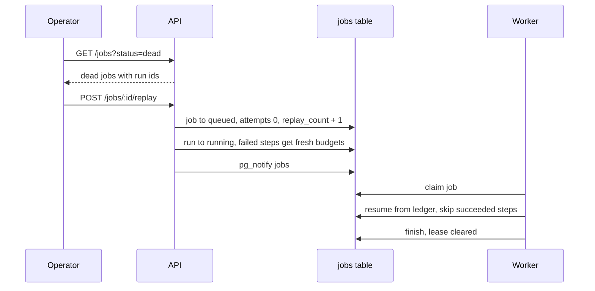

# 08. How dead jobs get a second chance

*Dead-letter behavior: seeing the dead, replaying them. Entry tag: `learn-08`.*

## The idea

The reaper (entry 07) retires poison jobs to `dead`: jobs whose workers kept dying, or whose runs kept failing, past every budget. Until this entry, `dead` was just a word in a status column. Nobody could see these jobs, nobody was told about them, and nobody could do anything with them. A dead-letter queue with no visibility and no replay is a graveyard. This entry makes it a tool.

Three pieces, matching what real message queues do.

**Visibility.** `GET /jobs?status=dead` lists the dead: which job, which queue, how many deliveries it burned, how many times a human already intervened, and the payload carrying the run id. The operator's first question is always "what died," and now it is one request.

**Replay.** `POST /jobs/:id/replay` is the human saying "I fixed it, try again." The job goes back to `queued` with fresh budgets: job attempts reset to 0, `replay_count` bumped so the intervention is on the record. The run flips back to `running`. And the failed steps get their attempt counters reset to 0.

That last part deserves a pause, because it is the subtlest decision in the entry. Why reset step attempts at all? Without the reset, the replayed run would re-claim the failed step, bump its counter from 5 to 6, see 6 ≥ 5, and give up instantly without firing a single new request. The human's fix would never get a chance. A replay means "the world changed, try again for real," so both budgets, job deliveries and step retries, start over.

But note what is *not* reset: succeeded steps. Their receipts stay exactly as they were, so the replayed execution resumes from the ledger and never re-fires completed work. In the poison-run test for this entry, step A had succeeded and step B had burned its budget; after the fix-and-replay, the worker skipped A entirely (the test server saw exactly one hit, from the first life) and gave B a fresh budget. Resume, not restart, all the way down.

Two guards keep replay honest. Only dead jobs can be replayed: anything else gets a 400, unknown ids get a 404. And only one replay wins: the reset query requires `status = 'dead'`, so two operators racing the same button cannot double-queue the job.

**Alerting.** When the reaper retires a job, it now also rings a second bell: `pg_notify('dead_letters', job_id)`. Nothing in Conduit listens to it yet, and that is deliberate. The channel is the hook; wiring it to Slack, PagerDuty, or a dashboard is operator configuration, the same way the `jobs` channel is. A dead-letter queue that cannot tap you on the shoulder is easy to forget, so the bell exists from day one.

## The diagram



The shape to notice: everything the operator does goes through two HTTP calls, and everything after the replay is the machinery from entries 04 through 07 doing what it already knows how to do.

## Try it yourself

This entry's tag is `learn-08`. You need the local stack running.

**Do.** Check out the tag, start Postgres, migrate, and start the API and one worker:

```
git checkout learn-08
docker compose -f infra/compose.yaml up -d
npm install
cp .env.example .env
npm run db:migrate
npm run dev:api
npm run dev:worker
```

**Do.** Create a workflow whose step points at `http://localhost:9/dead`, run it, and about 5 seconds in, `kill -9` the worker. Then, in the database, burn the job's remaining deliveries and expire its lease so you do not have to crash the worker twice more:

```
UPDATE jobs SET attempts = max_attempts, lease_expires_at = now() - interval '1 second'
WHERE status IN ('claimed', 'running');
```

**See.** Within 30 seconds the worker logs `reaper: requeued 0, dead 1`. Now look at the dead-letter queue:

```
curl -s 'localhost:3000/jobs?status=dead'
```

One job, with its attempts burned, `replay_count` 0, and the payload carrying your run id. The run itself reads `failed`.

**Do.** Replay it:

```
curl -s -X POST localhost:3000/jobs/<jobId>/replay
```

**See.** The job is `queued` with `replay_count` 1, the run is `running` again, and the worker picks it up within a second (the reaper is not involved; the replay rings the bell directly). The run fails again after its retries, because `localhost:9` is still dead. That is the correct lesson about replay: it grants fresh budgets, not miracles. It is for "I fixed it," and without a fix you get another failed run, not an infinite loop.

**Break.** Replay the same job id again, then try `GET /jobs?status=bogus`.

**See.** The second replay is a 400 (the job is no longer dead; only one replay wins) and the bogus status is a 400 (the filter is validated). Dead letters are strict about who gets a second chance.

**Decide and defend.** Before reading the code: replay resets failed steps' attempt counters to 0 but leaves succeeded steps untouched. Construct the exact failure if the reset were missing: what does the replayed execution do at the failed step, and how many new requests does the fixed API receive? (Then read `replayDeadJob` in `src/lib/queue.ts`.)

**Clean up.** `docker compose -f infra/compose.yaml down`.

## What we actually did

- `db/migrations/005_dead_letters.sql`: `replay_count` on jobs (how many times a human intervened), plus an index on `status` so the dead-letter listing stays cheap.
- `src/lib/queue.ts`: `replayDeadJob()` runs the whole replay in one transaction, job reset plus run reset plus step-budget reset, guarded by `status = 'dead'` so concurrent replays cannot double-queue. The reaper now also `pg_notify('dead_letters', job_id)` for every retired job: the alerting hook.
- `src/api/index.ts`: `GET /jobs` with an optional validated `?status=` filter (`/jobs?status=dead` is the dead-letter queue), and `POST /jobs/:id/replay` returning 404 for unknown jobs and 400 for non-dead ones.
- `docs/architecture.md`: ADR-006 records the decision.
- Verified against real Postgres 16 with 29 checks: dead-letter listing with payload run ids, filter validation, replay resetting job/run/step budgets with `replay_count` bumped and the bell rung, the 400/404/double-replay guards, a full replay end-to-end where a burned step budget got a fresh 2 attempts and succeeded, the `dead_letters` notify firing, and the resume-not-restart proof: after fix-and-replay, the previously succeeded step was not re-fired (one hit total) while the fixed step ran once and succeeded. Browse it at the [`learn-08`](https://github.com/VaidikV/conduit/tree/learn-08) tag.

Deliberately not built yet: scheduler concurrency and duplicate prevention, and the polling fallback for missed notifications. Note this entry quietly motivates that last one again: if the replay's `pg_notify` were ever lost, an idle worker would sleep through the resurrected job.

## Check your understanding

1. A replayed run had three steps: step 1 succeeded, step 2 failed after burning its budget, step 3 never ran. Describe what the replayed execution does at each step, and which HTTP requests fire.
2. Two operators POST `/jobs/:id/replay` at the same instant. What happens, and which line of SQL guarantees it?
3. Why does the reaper notify on a `dead_letters` channel instead of having the API poll the jobs table? What breaks if nobody listens?
4. The run was marked `failed` when its job went dead. Why is it safe for replay to flip it back to `running`? What earlier entry does the heavy lifting?
5. **Supervise the machine.** Ask an AI to explain what `dead` means in Conduit and how a dead job gets retried. Find what its answer gets wrong or leaves out. (Ours: dead means deliveries exhausted; only `POST /jobs/:id/replay` revives it, granting fresh job *and* step budgets while resuming from the ledger; guards are 404/400/double-replay; the `dead_letters` channel is the alert hook.)
